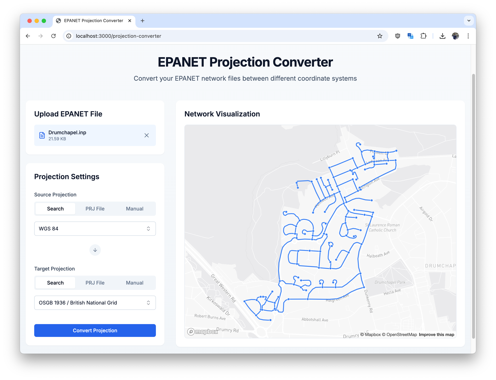

# EPANET Utilities

A collection of free and open-source utilities for working with EPANET models. This repository is designed to provide tools that help modelers with common tasks, improving workflows and compatibility with other systems.


## Available Utilities

### 1. Projection Converter

📂 **Path:** `/app/projection-converter`



A utility for reprojecting EPANET `.inp` files to different coordinate reference systems (CRS). This tool helps ensure spatial systems match when integrating hydraulic models with GIS or other mapping applications.

## Installation & Usage

This is a Next.js application. To install dependencies and run the project:

```sh
# Clone the repository
git clone https://github.com/modelcreate/epanet-utilities.git
cd epanet-utilities

# Install dependencies
pnpm install  # or npm install / yarn install

# Run the development server
pnpm run dev  # or npm dev / yarn dev

# Build the project
pnpm run build

# Start the production server
pnpm run start

# Lint the code
pnpm run lint
```

### Environment Variables

Create a `.env` file in the project root. You can copy and rename the `.env.example` file to `.env.local`.

Make sure the following line is in your `.env.local` file:

```sh
NEXT_PUBLIC_MAPBOX_TOKEN=your_token_here
```

Obtain a token from your [Mapbox account](https://account.mapbox.com/).

## Contributing

Contributions are welcome! If you have ideas for new utilities or improvements to existing ones, feel free to open an issue or submit a pull request.

### Future Tools

- Set elevations, from worldwide DEM or ASCII file
- Extract GIS
- Export results, report and bin file
- Fire flow simulation
- .net file conversion
- compare .bin files between version of EPANET

## License

This project is licensed under the MIT License. See the `LICENSE` file for details.

---

🚀 More utilities coming soon!
